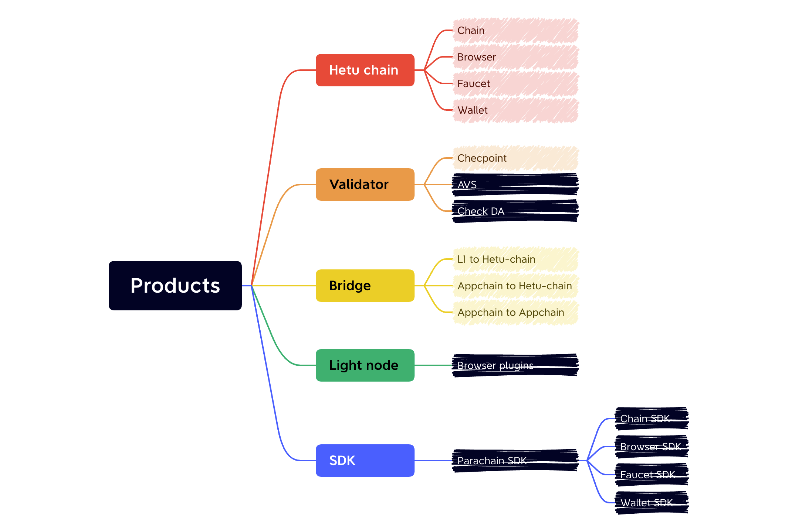

## Products
Get an overview of the capabilities associated with an Hetu Stack App  Chain.

##### Hetu Chain
EVM Compatibility: Seamlessly integrates with Ethereum ecosystem development tools.
Upcoming WASM Support: Offers native high-performance execution environments for Rust/C++ developers.
##### Bridges
Cross-Chain Support: Enables asset and message transfers between Hetu and major public chains like Ethereum, Solana, and third-party App Chains.
Standardized APIs: Provides developers with tools for quick and easy integration of cross-chain functionalities.
##### Validator
Node Operation: Validators run nodes to participate in transaction sequencing, requiring a high staking threshold.
Checkpoint Signing: Ensures security for checkpoint signatures with a lower participation barrier.
Future Active Validation Services (AVS): Validators can provide services for networks like EigenLayer.
##### Light Node
Browser Extension: A lightweight node that supports instant querying of on-chain data and asset balances.
Built-in Cross-Chain Bridging: Allows users to complete multi-chain transfers directly within their wallets.
Integrated DApp Browser: Provides one-click access to decentralized applications within the ecosystem.

## Wallet Configuration
### Test Network
Network Name： Hetu - testnet  
Chain ID：  560000  
RPC URL：  
Symbol :  Hetu  
Block Explorer UR:     

###  Install Wallet
- Recommended wallets:  [MetaMask](https://metamask.io/) or [Trust Wallet](https://trustwallet.com/)
- Install via browser extension or mobile app store

##  Cross-chain Asset Transfer
### ETH → HETU

1. Visit the [Cross-Chain Bridge Page].
2. Connect your wallet and select "ETH to HETU".
3. Enter the transfer amount (minimum 0.01 ETH).
4. Confirm the transaction (Ethereum Gas fees will apply).

### HETU → ETH
1. Hold ETH in application chain wallet
2. Initiate redemption transaction (2-minute waiting period)
3. Assets will arrive after 15 Ethereum blocks

