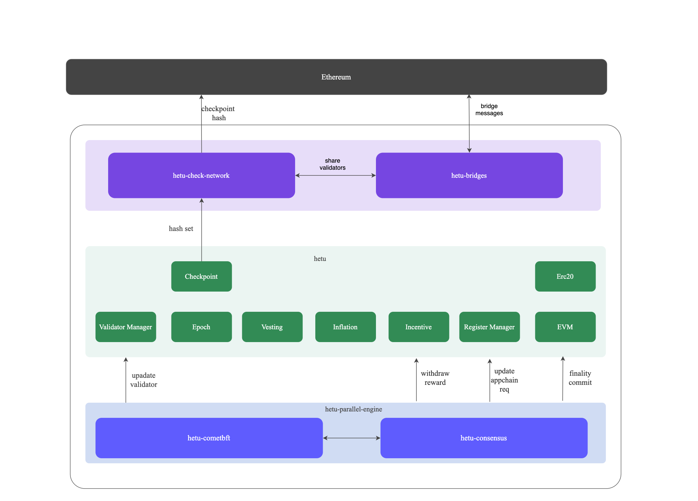

## summary

####  Layered Collaboration
Hetu's main chain handles consensus coordination and validator management, while application chains (APP Chains) focus on business execution. This forms a "main chain coordination + multi-chain parallelism" architecture.

#### ETH-Driven Ecosystem
ETH serves as the medium for gas payments and cross-chain assets, enabling seamless circulation within and outside the ecosystem through standardized bridges. A Checkpoint mechanism periodically anchors the main chain's state snapshots to Ethereum to ensure security.

#### HETU Governance
The HETU token supports decentralized governance and validator staking, ensuring network upgrades and security decisions are made collectively by the community.

#### Modular Expansion
Developers can quickly build application chains that reuse the main chain's security layer. Users enjoy a unified multi-chain experience, balancing efficiency and decentralization.

## Components

##### Data Availability
The Data Availability (DA) layer defines the location where raw inputs are published. Currently, Hetu DA is the preferred data availability solution within the Hetu ecosystem. All ecosystem components can retrieve various types of information from Hetu as source data on demand.

##### Sequencing
This part is primarily composed of a customized combination of CometBFT, Narwhal, and Bullshark, ensuring complete decentralization. The system leverages Narwhal to build a DAG (Directed Acyclic Graph) structure for transaction processing, while the Bullshark consensus algorithm sequences transactions, achieving high TPS (transactions per second). It supports dynamic adjustment of validator weights to prevent malicious nodes from manipulating transaction order.

##### Execution
The system fully supports Ethereum smart contracts, enabling seamless migration of DApps. It decouples consensus from execution and supports hot-swappable virtual machines (VMs). Third-party chains can also customize their own VMs.

##### Settlement
Hetu Chain serves as the settlement layer, recording state commitments of connected chains. Periodic state snapshots are provided by the Checkpoint Layer and anchored to Ethereum for finality.

##### Governance
Users can stake Hetu Token to become validators, participating in consensus or checkpoint signing. Malicious nodes are penalized through slashing, where a portion of their staked assets are forfeited. Validators in the consensus layer require high staking weights, while checkpoint signers can participate with lower barriers to entry.

##### Bridges
Based on the Gravity Protocol, Hetu connects to main chains, other L1s (such as Ethereum and Solana), and third-party App Chains.

##### Checkpoint Layer
Periodically generates checkpoints and anchors them to Ethereum, ensuring the immutability of historical data. It employs BLS threshold signatures, where a committee of validators signs the checkpoint data. A checkpoint becomes valid once it receives approval from 2/3 of the committee.

