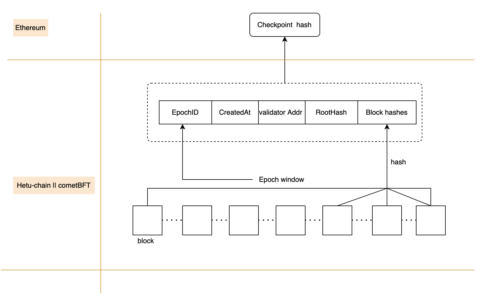

# Hetu Checkpoint

Hetu Checkpoint is a secure and efficient checkpointing system that leverages Distributed Key Generation (DKG) and BLS signatures to prevent long-range attacks on blockchain networks.

## Overview

Hetu Checkpoint creates secure checkpoints for multiple blocks using a network of validators. These checkpoints are then anchored to Ethereum, providing an additional layer of security and finality.

## Key Features

- **Epoch-based Checkpointing**: Divides blockchain into epochs with fixed validator sets
- **DKG Integration**: Secure distributed key generation for validator coordination
- **BLS Signatures**: Efficient aggregated signatures for checkpoint creation
- **Ethereum Anchoring**: Checkpoint hashes are recorded on Ethereum
- **Long-range Attack Prevention**: Enhanced security through periodic checkpointing

## System Components
### Validator Network

Distributed network of validators
Consensus on checkpoint generation
BLS signature aggregation
### DKG System

Secure key generation
Validator coordination
Threshold signature scheme
### Checkpoint Generation

Aggregates multiple blocks
Creates unified checkpoint hash
BLS signature verification
### Ethereum Bridge

Submits checkpoint hashes to Ethereum
Provides immutable checkpoint records
Enables cross-chain verification

## Technical Details
### Epoch Configuration
Fixed number of blocks per epoch
Consistent validator set within each epoch
Configurable epoch parameters
### Security Features
- BLS Signatures: Efficient signature aggregation Reduced communication overhead Strong cryptographic security
- DKG Protocol: Distributed trust model No single point of failure Threshold-based security