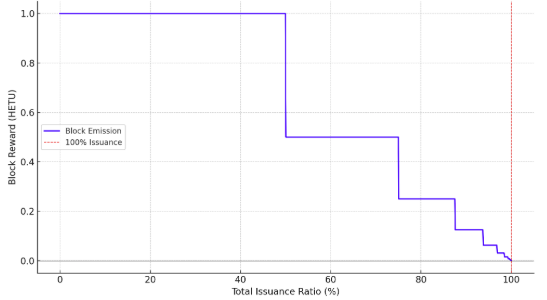
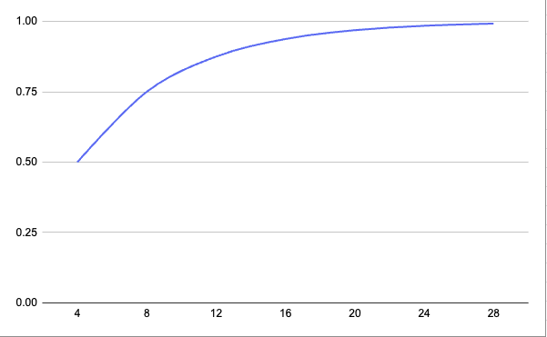
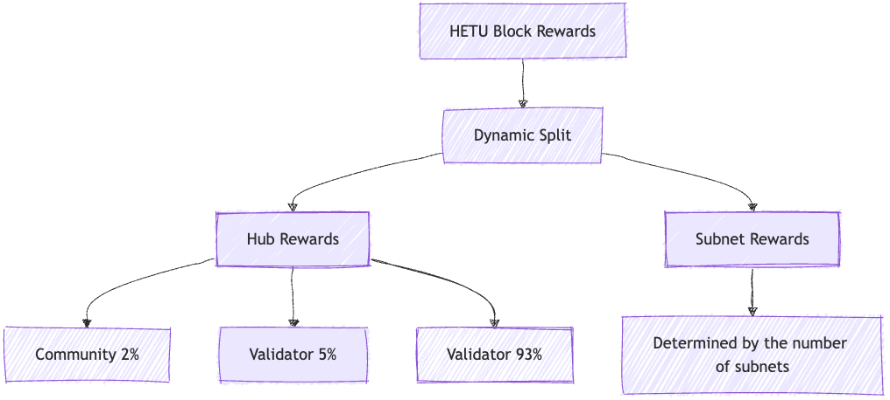
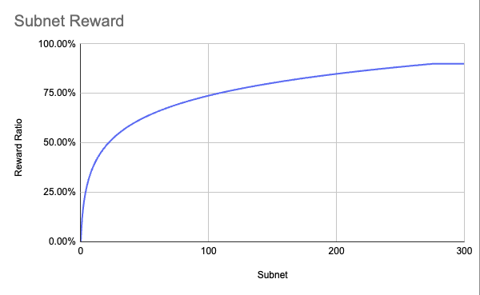
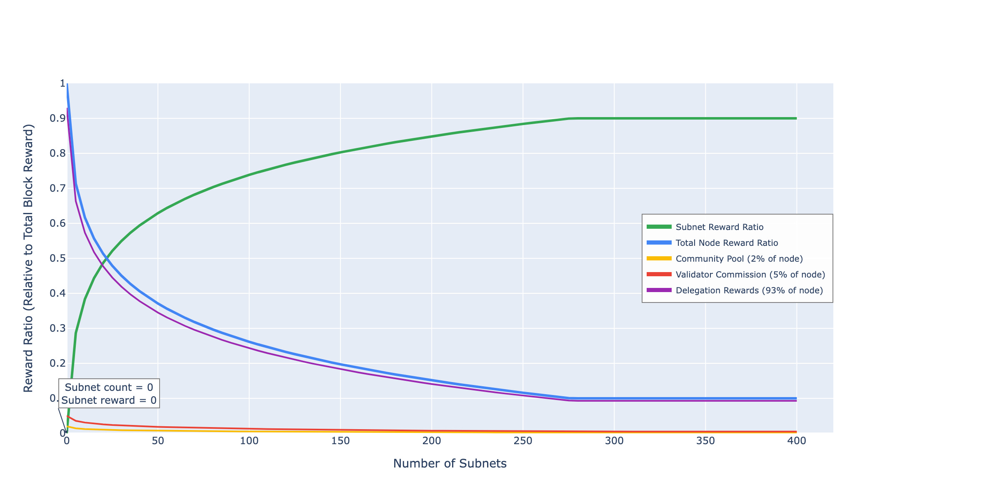

# Economic Model

## I. Block Rewards

We adopt a Logarithmic Decay Algorithm based on issuance ratio (LSED model).

The core logic is based on the formula `log2(1 / (1 - ratio))`, and the emission decay presents a `1/2ⁿ` pattern.

### 1. Mathematical Expression of the Decay Algorithm
- `R` is the current total issuance (total_issuance)
- `S` is the total supply (total_supply) = 21,000,000 HETU
- `E₀` is the default block reward: 1 HETU/block
- `r = R / S` is the current issuance ratio (0 ≤ r < 1)
- `E(r)` is the current actual reward

Then:

$$
E(r) = E_0 \times \frac{1}{2^{\lfloor \log_2 \left( \frac{1}{1-r} \right) \rfloor}}
$$

- If `r ≥ 1`, `E(r) = 0`

### 2. Trigger Points of Each Decay Cycle
    
| Halving Cycle | r (Issuance Ratio)     | Block Reward (HETU) |
| ------------- | ---------------------- | ------------------- |
| 0             | 0% ~ 50%               | 1                   |
| 1             | 50% ~ 75%              | 0.5                 |
| 2             | 75% ~ 87.5%            | 0.25                |
| 3             | 87.5% ~ 93.75%         | 0.125               |
| 4             | 93.75% ~ 96.875%       | 0.0625              |
| 5             | 96.875% ~ 98.4375%     | 0.03125             |
| 6             | 98.4375% ~ 99.21875%   | 0.015625            |
| ...           | ...                    | ...                 |

### 3. Cycle Schedule Calculated Based on 12-Second Blocks
- Total supply: 21,000,000 HETU
- Initial reward per block: 1 HETU
- Block generation speed: 12 seconds/block ≈ 5 blocks/minute

We estimate the duration based on the amount of HETU that can be released in each stage:
   
| Decay Cycle | Block Reward (HETU) | Ratio Range  | Stage Supply (HETU) | Time (Years) | Block Height Range     |
|-------------|---------------------|--------------|---------------------|--------------|------------------------|
| 0           | 1                   | 0% ~ 50%     | 10,500,000          | ~4           | 0 ~ 10.5M              |
| 1           | 0.5                 | 50% ~ 75%    | 5,250,000           | ~4           | 10.5M ~ 15.75M         |
| 2           | 0.25                | 75% ~ 87.5%  | 2,625,000           | ~4           | 15.75M ~ 18.375M       |
| 3           | 0.125               | 87.5% ~ 93.75% | 1,312,500         | ~4           | ...                    |
| ...         | ...                 | ...          | ...                 | ~4           | ...                    |

### 4. Reward Decay Curve (Issuance Ratio vs. Block Reward)
(Exponential decay graph with issuance ratio on the horizontal axis and block reward on the vertical axis)

- Horizontal axis: proportion of total issuance (0% to 100%)
- Vertical axis: block reward (unit: HETU)
- The reward decreases exponentially, and a halving is triggered whenever the issuance ratio reaches `1 - 1/2ⁿ`

### 5. Release Model Curve

## II. Block Reward Allocation

### 1. Introduction to Block Rewards

- Stakework rewards (subnet rewards)
- Main network rewards
  - Community (community pool): 2%
  - Validator (commission): 5%
  - Validator (validator rewards, allocated according to weight and delegation): 93%

### 2. Introduction to Subnet Rewards

#### (1) Algorithm Introduction

Logarithmic Subnet Incentive (LSI) "logarithmic" subnet reward mechanism

Calculation formula:

**subnet_reward_ratio = min( max_ratio, base + k * log(1 + subnet_count) )**

Where:
- **base**: Initial subnet reward ratio (e.g., 0.10)
- **k**: Growth rate coefficient (e.g., 0.16)
- **max_ratio**: Maximum subnet reward ratio (e.g., 0.9)

#### (2) Calculation Process

| subnet_count | subnet_reward_ratio |
| --- | --- |
| 0 | 0 |
| 1 | 0.1109035489 |
| 2 | 0.1757779662 |
| 3 | 0.2218070978 |
| 4 | 0.257510066 |
| 5 | 0.2866815151 |
| 6 | 0.3113456238 |
| 7 | 0.3327106467 |
| 8 | 0.3515559324 |
| 9 | 0.3684136149 |
| 10 | 0.3836632436 |

#### (3) Subnet Reward Growth Curve Chart:

- **As the number of subnets increases, the reward ratio gradually increases.**
- **The growth rate is controlled by the parameter k.**
- **The reward ratio is limited by the maximum value of max_ratio = 0.9, and it will not increase after reaching the upper limit.**

#### Explanation:

1. **Initial stage** (number of subnets < 50)
   - The ratio starts from `base=0.10` and grows slowly with `log(1+subnet_count)`.
   - For example:
     - 1 subnet: `0.10 + 0.1*log(2) ≈ 0.17`
     - 10 subnets: `0.10 + 0.1*log(11) ≈ 0.34`
2. **Rapid growth stage** (50 ≤ number of subnets < 300)
   - The logarithmic function enters a significant growth interval, and the ratio rises rapidly.
   - For example:
     - 100 subnets: `0.10 + 0.1*log(101) ≈ 0.56`
     - 200 subnets: `0.10 + 0.1*log(201) ≈ 0.66`
3. **Saturation stage** (number of subnets ≥ 300)
   - When the ratio is close to `max_ratio=0.9`, the formula triggers the `min()` function to limit growth.
   - Calculation of the turning point:
     
     `0.10 + 0.1*log(1+x) = 0.9` → `log(1+x)=8` → `x≈e⁸≈2981`
     
     **Actually, due to the limitation of calculation accuracy, it is close to the upper limit when x≈300 in the figure**.
     
   - After that, the ratio remains unchanged at `0.9` (horizontal line).

### 3. Incentive Sharing Curve Chart

